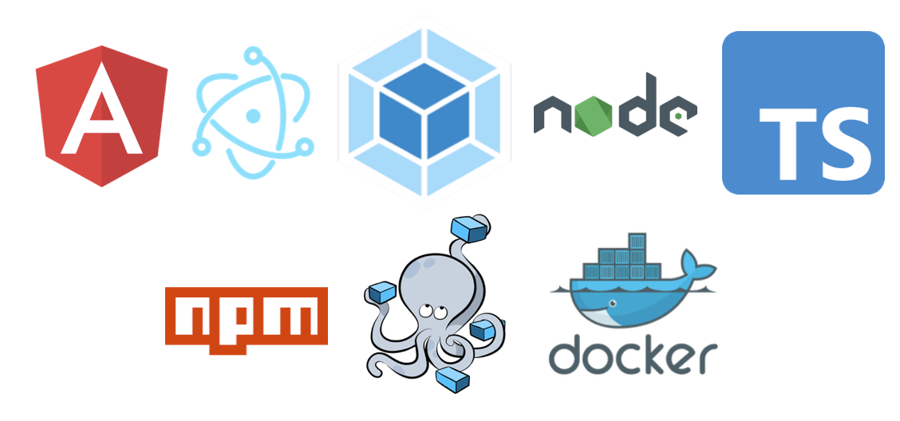

# Implo Launcher

## About

A launcher for the minecraft project 'Low on Time'. The launcher will download the mod pack from GitHub and adjust add 
the minecraft launcher profiles. This way one can play press play and open the minecraft launcher with the 
installation already present.

## Technologies



## Getting Started

### Requirements

- Docker
- Docker Compose
- NPM
- NodeJS
- Git Bash (for clean option, not mandatory)

### Development

For the development there is a script for watch which compiles the whole code on change and a script for starting 
the compiled code.

#### Watch

Will watch the code on change.

```shell
npm run watch
```

or

```shell
npm run watch:clean
```

this script will clean the dist directory

#### Start

will start the compiled code in the `dist` directory

```shell
npm start
```

### Production

The package script is for building the application for production the general syntax is the following

```shell
npm run package:<plattform>:<[clean]>
```

The application is available to build for `MacOS` and `Windows`

#### All

This script will build for `MacOS` and `Windows`.

```shell
npm run package:all
```

#### Windows

This script will build for `Windows`

```shell
npm run package:win
```

#### MacOS

This script will build for `MacOS`

```shell
npm run package:mac
```
